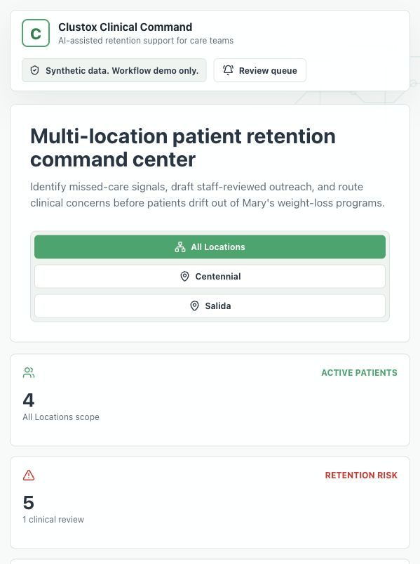
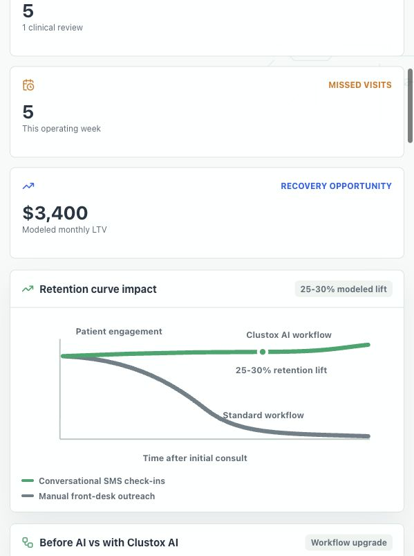
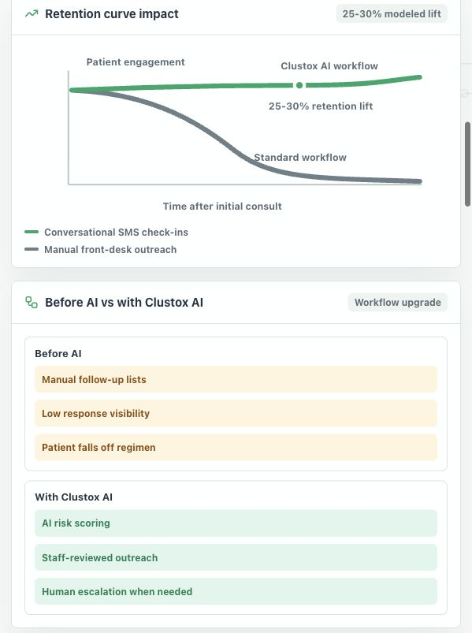
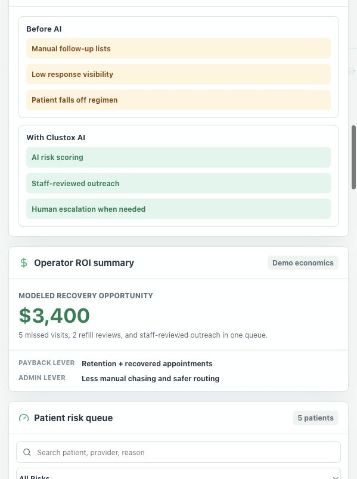
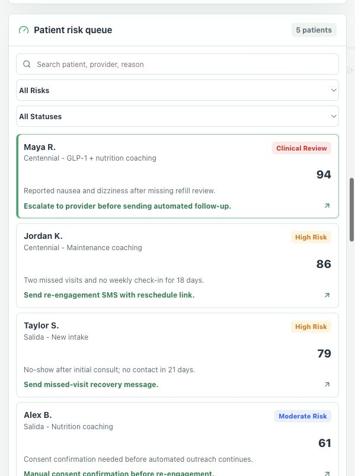
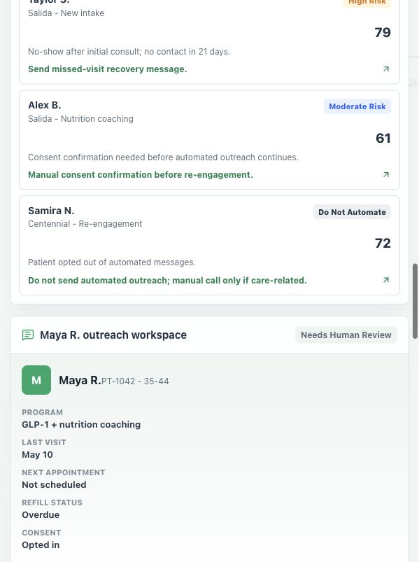

# Clustox Clinical Retention MVP Walkthrough

This document explains the demo screens and core functions for the Medical Weight Loss AI Retention Assistant POC.

The MVP is designed to showcase a privacy-conscious, staff-reviewed workflow for Mary Verity's multi-location medical weight-loss clinic. It uses synthetic patient data only and does not claim production HIPAA certification.

## 1. Command Overview

### What this screen shows

The opening screen positions the product as a multi-location patient retention command center. It immediately communicates the core promise: identify missed-care signals, draft staff-reviewed outreach, and route clinical concerns before patients fall out of the program.

### Main functions

- **Location filter:** Switches the operating scope between All Locations, Centennial, and Salida.
- **Active patients metric:** Shows the currently scoped patient count.
- **Retention risk metric:** Shows how many patients are flagged for follow-up or review.
- **Missed visits metric:** Quantifies recent appointment gaps.
- **Recovery opportunity metric:** Estimates monthly value tied to recovered engagement.
- **Safety banner:** States that the demo uses synthetic data and is for workflow demonstration.

### Demo talk track

“Mary’s team can start the morning here. Instead of checking spreadsheets, SMS threads, and appointment notes separately, they see which location needs attention and which patients are at risk.”

## 2. Retention Curve and Workflow Upgrade

### What this screen shows

This section directly reflects the sales deck’s retention story. The standard workflow declines over time, while the Clustox AI workflow maintains engagement through automated continuity and staff-reviewed follow-up.

### Main functions

- **Retention curve:** Visualizes the 25-30% modeled retention lift from continuous follow-up.
- **Manual outreach baseline:** Shows the standard front-desk process that leads to lower visibility and drop-off.
- **Clustox AI workflow:** Shows the upgraded process: AI risk scoring, staff-reviewed outreach, and human escalation.

### Demo talk track

“The value is not just sending reminders. The system creates continuity after the initial consult, where many medical weight-loss patients typically disengage.”

## 3. Before/After Workflow and ROI Summary

### What this screen shows

This section connects workflow improvement to business outcomes. It explains the difference between the current operating model and the AI-assisted model, then summarizes the payback logic.

### Main functions

- **Before AI:** Manual follow-up lists, low response visibility, and patient drop-off.
- **With Clustox AI:** AI risk scoring, staff-approved outreach, and escalation when needed.
- **Operator ROI summary:** Models recovery opportunity from missed visits, refill reviews, and re-engagement tasks.
- **Payback levers:** Links retention improvement and reduced manual work to business value.

### Demo talk track

“This is the business case. The clinic recovers appointments and lifetime value while reducing manual chasing for the front desk.”

## 4. Patient Risk Queue and Filters

### What this screen shows

The patient risk queue ranks patients by engagement and clinical/admin risk. It replaces manual memory or scattered notes with an ordered queue of who needs attention.

### Main functions

- **Search:** Finds patients by name, ID, provider, program, location, or risk reason.
- **Risk filter:** Narrows the queue by risk type, including Clinical Review, High Risk, Moderate Risk, and Do Not Automate.
- **Status filter:** Narrows by operating status such as At Risk, Missed Visit, Needs Follow-Up, or Opted Out.
- **Patient row:** Shows name, location, program, risk category, risk score, reason, and recommended next action.
- **Empty state:** If filters return no matches, the app explains how to recover the demo flow.

### Demo talk track

“Instead of treating every missed message the same, the system ranks the queue. Clinical concerns rise above routine reminders, and opted-out patients are clearly blocked from automation.”

## 5. Patient Outreach Workspace

### What this screen shows

The outreach workspace gives staff the full context for a selected patient: program, last visit, next appointment, refill status, consent, risk reason, and conversation history.

### Main functions

- **Patient summary:** Displays relevant operational context before staff takes action.
- **Conversation thread:** Shows prior clinic messages, patient replies, and AI draft context.
- **AI suggested response:** Provides an editable outreach draft.
- **Tone controls:** Switches the draft between Friendly, Clinical, and Urgent.
- **Approve outreach:** Adds the staff-approved message to the conversation.
- **Escalate to provider:** Routes clinical concerns to human review.
- **SOAP preview:** Opens a structured documentation teaser.

### Demo talk track

“The AI is not making clinical decisions. It drafts language and highlights risk, but staff reviews, edits, approves, or escalates before anything sensitive moves forward.”

## 6. SOAP Preview, Operations, ROI, and Audit Trail

### What this screen shows

The lower sections show how the POC expands from outreach into operational visibility, ROI tracking, and auditability.

### Main functions

- **SOAP documentation preview:** Converts conversation context into a lightweight Subjective, Assessment, and Plan preview. It is labeled as a teaser, not an autonomous charting tool.
- **Multi-location operations:** Shows operating metrics for appointment gaps, inventory watch, refill reviews, and unread replies.
- **Location distribution:** Shows queue volume across Centennial and Salida.
- **Workflow strip:** Connects location data, AI triage, and staff-approved outreach.
- **POC ROI matrix:** Summarizes recovered appointments, admin hours saved, and modeled retention lift.
- **Audit and guardrails:** Logs risk scoring, draft generation, opt-out blocking, clinical escalation, approval, and consent events.

### Demo talk track

“This is where the POC becomes an operating system. Mary can see retention risk, staff workload, refill-review pressure, and audit trail in one place.”

## Function Checklist

| Function | What it proves | Demo action |
| --- | --- | --- |
| Location filtering | Multi-location command center | Click Centennial or Salida |
| KPI updates | Scope-aware operating metrics | Watch metrics change after filtering |
| Retention curve | 25-30% modeled retention improvement story | Scroll to Retention curve impact |
| Before/after workflow | Clear contrast between manual and AI-assisted operations | Show Before AI vs With Clustox AI |
| Search | Fast queue triage | Search for `Jordan` |
| Risk/status filters | Staff can isolate clinical/admin priorities | Choose High Risk or Clinical Review |
| Patient selection | Drill down from queue to patient workspace | Click a patient row |
| AI draft | AI-assisted outreach | Review the suggested SMS |
| Tone switching | Staff can adjust communication style | Click Friendly, Clinical, or Urgent |
| Edit draft | Human remains in control | Change the SMS text |
| Approve outreach | Staff-approved sending path | Click Approve outreach |
| Escalation | Sensitive messages route to humans | Click Escalate to provider |
| SOAP preview | Future charting direction | Click SOAP preview |
| Operations metrics | Broader clinic command-center value | Review appointment gaps, inventory watch, refill reviews |
| ROI matrix | Business value narrative | Review recovered appointments, admin hours, retention lift |
| Audit trail | Governance and compliance posture | Review Audit and guardrails |

## LLM Integration Recommendation

The MVP does not need live LLM integration for the sales demo. The current local simulation is intentionally deterministic, reliable, and safe for presentation.

Live LLM integration should be a phase-two decision after these items are defined:

- whether PHI will ever be sent to a model provider
- what model/provider will be used
- whether a BAA or equivalent compliance agreement is required
- how prompts, outputs, approvals, and blocked messages are audited
- how medical-safety guardrails are tested
- how staff review is enforced before sending messages

For the POC, the right message is:

> “This demo shows the workflow and product experience. In production, the AI generation layer would be connected behind privacy, audit, and staff-approval controls.”

## Deployment Notes

The app is a Vite React application.

Recommended Netlify settings:

- Build command: `npm run build`
- Publish directory: `dist`
- Redirects: route all paths to `/index.html`

These settings are captured in `netlify.toml`.
